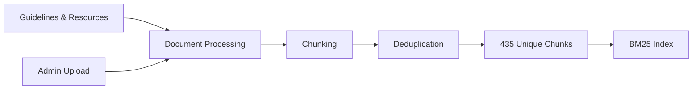
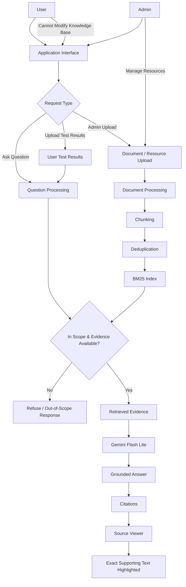

# Hypertension Guideline RAG

**AI Clinical Decision Support Hackathon Project**

A retrieval-augmented generation (RAG) system for hypertension-focused clinical information, built around authoritative guidelines and grounded answers with verifiable citations.

The system has separate **User** and **Admin** sides. Both can ask questions, while administrators can also manage the knowledge base by uploading documents and resources. Users can additionally upload their hypertension test results to provide personal context for their questions.

---

## Overview

The system currently uses four main sources covering hypertension treatment, screening, and population data:

* **WHO 2021** — Pharmacological Treatment of Hypertension in Adults
* **ESC 2024** — European Society of Cardiology Guidelines
* **USPSTF** — Hypertension Screening Recommendation
* **CDC Health E-Stats** — Adult Hypertension Data

The final retrieval pipeline uses **BM25 over a deduplicated corpus of 435 chunks**. Retrieved evidence is passed to **Google Gemini Flash Lite**, which generates the final response based on the retrieved context.

The original corpus contained **813 chunks**. After preprocessing and deduplication, this was reduced to **435 unique chunks**.

---

## Features

### 👤 User Side

Users can:

* Ask questions about hypertension and receive **grounded, citation-backed answers**.
* Upload their own **hypertension test results** and use them as additional context when asking questions.
* Open citations to see the **exact supporting text from the source document**.
* View the relevant evidence with the cited passage **highlighted**, making answers easier to verify.
* Ask follow-up questions within the supported hypertension domain.

### 🔐 Admin Side

Administrators have the same question-answering capabilities as users, with additional knowledge-base management functionality.

Admins can:

* Ask questions and receive the same grounded, cited answers.
* Upload new **documents and resources** to the knowledge base.
* Add new guidelines and reference material to the system.
* Manage the resources used by the RAG pipeline.

Regular users cannot modify the system's underlying knowledge base.

### 📚 Evidence & Citations

The system is designed so that generated answers can be traced back to their supporting evidence.

Each citation can be opened to view the corresponding source document and the **exact text used to support the answer**, with the relevant passage highlighted.

This makes it possible to verify an answer against the original source rather than simply trusting the generated response.

### 🛡️ Scope Control

The system is intentionally restricted to its intended hypertension domain.

If a question is outside the supported scope, or if the available evidence is insufficient to answer it reliably, the system **does not attempt to fabricate an answer**.

This helps keep the system focused on the information it was designed and evaluated to handle.

---

## Results

The system was evaluated on a **200-question benchmark** covering retrieval quality, answer correctness, faithfulness, and citation quality.

| Metric                |          Result |
| --------------------- | --------------: |
| **Hit@1**             |       **75.5%** |
| **Hit@5**             |       **94.5%** |
| **MRR**               |       **0.826** |
| **Retrieval latency** | **~2 ms/query** |
| **Faithfulness**      |     **5.0 / 5** |
| **Correctness**       |    **4.84 / 5** |
| **Citation validity** |        **0.99** |

The largest improvement during the retrieval experiments came from deduplication. Reducing the corpus from **813 to 435 chunks improved Hit@1 by 17.5 percentage points**.

---

## Retrieval

The final system uses **BM25** as its primary retrieval method.

Several retrieval configurations were tested during development, including dense and hybrid approaches. BM25 provided the best overall balance for this dataset, giving strong retrieval performance while keeping the system simple and fast.

The retrieval pipeline operates on the deduplicated corpus and returns the most relevant guideline chunks for each question.

### Knowledge Base Pipeline



Administrators can extend the knowledge base by uploading additional documents and resources, which are processed and added to the retrieval pipeline.

---

## Generation & Grounding

Retrieved evidence is provided to **Google Gemini Flash Lite** using a grounding-focused prompt.

The generation pipeline is designed to:

* Base answers on retrieved evidence.
* Include citations to supporting sources.
* Avoid unsupported claims.
* Refuse when sufficient evidence is unavailable.
* Keep the model temperature low for more consistent responses.
* Reject questions outside the supported domain.

In the 200-question evaluation, the generated answers received a **5.0/5 faithfulness score**, with no hallucinations identified by the evaluation process.

---

## Architecture



### Request Flow

```text
Question
   │
   ▼
Scope & Evidence Check
   │
   ├── Out of scope / insufficient evidence
   │          │
   │          ▼
   │      Refuse to answer
   │
   └── Supported question
              │
              ▼
        BM25 Retrieval
              │
              ▼
       Relevant Evidence
              │
              ▼
       Gemini Flash Lite
              │
              ▼
     Grounded Answer
              │
              ▼
       Citations + Sources
              │
              ▼
   Exact Evidence Highlighted
```

---

## Tech Stack

| Component            | Technology                                       |
| -------------------- | ------------------------------------------------ |
| **Language**         | Python 3.11                                      |
| **Retrieval**        | BM25 · `rank-bm25`                               |
| **Vector Store**     | Qdrant                                           |
| **Embeddings**       | Google `gemini-embedding-001` (3072-d)           |
| **Generation**       | Google Gemini Flash Lite                         |
| **Chunking**         | `tiktoken` (600-token chunks / 80-token overlap) |
| **UI**               | Gradio                                           |
| **Backend**          | Flask                                            |
| **Deployment**       | Hugging Face Spaces                              |
| **Containerization** | Docker                                           |
| **Server**           | Waitress                                         |
| **Evaluation**       | Custom benchmark + LLM-based evaluation          |

---

## Demo


*A short demonstration of the system, from submitting a question to receiving a grounded answer with supporting sources.*

---

## Creativa Orange Hackathon


This project was developed as part of the **Creativa Orange Hackathon**.

The goal was to build a practical RAG-based system that could make information from hypertension guidelines easier to access while keeping generated answers tied to the underlying sources.

### Highlights

* **94.5% Hit@5**
* **75.5% Hit@1**
* **5.0/5 faithfulness**
* **4.84/5 correctness**
* **0.99 citation validity**
* **~2 ms/query retrieval latency**
* **813 → 435 chunks** after deduplication
* **+17.5 percentage points in Hit@1** from deduplication
* Interactive citations with highlighted source evidence
* User and Admin interfaces
* User test-result uploads
* Admin document/resource uploads
* Out-of-scope question handling
* Live deployment using Gradio and Hugging Face Spaces

---

## Team

This project was built as a team for the **Creativa Orange Hackathon**.

A big thank you to everyone who contributed their time, ideas, and effort:

* **Yakoot Shaker**
* **Yasser Eldaly**
* **Youssef Gomaa**
* **Mostafa Hazem**

I really appreciate the work and collaboration that everyone put into making this project happen.

---

## Quick Start

### 1. Install dependencies

```bash
pip install -r requirements.txt
```

### 2. Set your Gemini API key

**Windows PowerShell:**

```powershell
$env:GEMINI_API_KEY="your_key_here"
```

**Windows CMD:**

```cmd
set GEMINI_API_KEY=your_key_here
```

**Linux / macOS:**

```bash
export GEMINI_API_KEY="your_key_here"
```

### 3. Run the application

```bash
python gradio_app.py
```

The Gradio interface will be available at:

```text
http://localhost:7860
```

---

## Repository Structure

```text
.
├── Dockerfile
├── README.md
├── app.py
├── gradio_app.py
├── requirements.txt
│
├── data/
│   └── processed/
│       └── # Validated chunks and deduplication artifacts
│
├── evaluation/
│   ├── EXPERIMENTS.md
│   ├── EVALUATION_REPORT.pdf
│   ├── generation_results.json
│   └── retrieval_200_dedup_results.json
│
└── src/
    └── rag/
        ├── bm25_retriever.py
        ├── rag_pipeline.py
        └── ...
```

---

## Evaluation

Detailed evaluation results and experiments are available in the `evaluation/` directory:

* `EXPERIMENTS.md` — retrieval experiments and comparisons
* `EVALUATION_REPORT.pdf` — complete evaluation report
* `retrieval_200_dedup_results.json` — retrieval benchmark results
* `generation_results.json` — generation evaluation results

---

## Medical Disclaimer

This project is a **hackathon and research prototype** and is not intended to replace professional medical judgment or serve as a medical device.

The system is designed to demonstrate grounded retrieval and generation over hypertension guidelines. Clinical decisions should be based on the original guidelines, patient-specific information, and the judgment of qualified healthcare professionals.

---

## License

MIT License.
