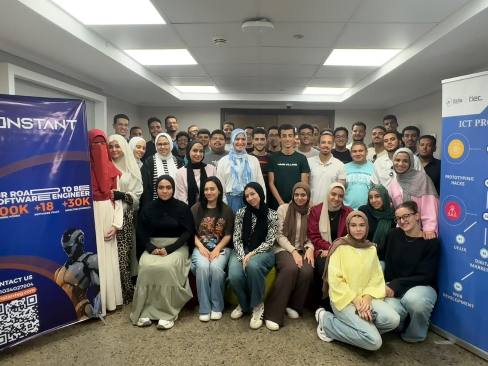

# Hypertension Guideline RAG

**AI Clinical Decision Support Hackathon Project**  
Real-time, grounded hypertension guidance with zero hallucination.

---

## 📖 Project Overview

A retrieval-augmented generation (RAG) system over four authoritative hypertension guidelines:
- **WHO 2021** — Pharmacological treatment of hypertension in adults
- **ESC 2024** — European Society of Cardiology guideline
- **USPSTF** — Screening recommendation
- **CDC Health E-Stats** — Adult hypertension data

The system retrieves evidence using **BM25 on a deduplicated 435-chunk corpus** and generates answers grounded in the retrieved context via **Google Gemini Flash Lite**.

---

## ✨ Key Results (200-question benchmark)

| Metric | Score |
|---|---|
| **hit@1** | 75.5% |
| **hit@5** | 94.5% |
| **MRR** | 0.826 |
| **Latency** | ~2 ms/query |
| **Faithfulness** | **5.0/5** (zero hallucination) |
| **Correctness** | 4.84/5 |
| **Citation validity** | 0.99 |

**Deduplication** (813 → 435 chunks) was the single biggest improvement (+17.5 pts hit@1).

---

## 🛠 Tech Stack

- **Language:** Python 3.11
- **Retrieval:** BM25 (`rank-bm25`), Qdrant vector store, Google `gemini-embedding-001` (3072-d)
- **Generation:** `google-genai` · `gemini-flash-lite-latest` (temperature 0.1)
- **Chunking:** `tiktoken` · 600/80 tokens
- **UI:** Gradio (Hugging Face Spaces) + Flask
- **Evaluation:** Custom benchmark scripts (`benchmark_200.py`) + LLM judge (temperature 0.0)
- **Infra:** Docker + waitress, Hugging Face Space (ZeroGPU)

---

## ▶️ 1-Minute Video

<video width="400" controls>
  <source src="demo_video.mp4" type="video/mp4">
  Your browser does not support the video tag.
</video>

---

## 📸 Photo at Creative Orange Hackathon



*This project was developed as part of the Creative Orange Hackathon, showcasing an AI-powered clinical decision-support system for hypertension guidelines. The system retrieves evidence from major medical guidelines (WHO, ESC, USPSTF, CDC) using BM25 sparse retrieval on a deduplicated corpus, and generates grounded, citation-verified answers using Google Gemini Flash Lite.*

*Key achievements:*
- **Faithfulness 5.0/5** – zero hallucination across 200 evaluated answers
- **Correctness 4.84/5** – high-quality grounded responses  
- **hit@5 94.5%** retrieval accuracy on deduplicated corpus
- **~2 ms/query** latency for real-time clinical assistance

*Technical highlights:*
- Deduplication (813→435 chunks) was the single biggest improvement (+17.5 pts hit@1)
- BM25 over dense/hybrid/reranker variants – best performance at minimal cost
- Grounding-first generation: refuses on missing evidence, never fabricates
- Deployed live on Hugging Face Spaces (Gradio + ZeroGPU)

*Value proposition:* Clinicians get instant, evidence-backed hypertension guidance at point-of-care, with verifiable sources and zero hallucination – addressing the critical need for trustworthy AI in clinical decision support.

---

## 🚀 Quick Start

```bash
# 1. Install dependencies
pip install -r requirements.txt

# 2. Set your Gemini API key
set GEMINI_API_KEY=your_key_here

# 3. Run the Gradio app
python gradio_app.py

# 4. Open http://localhost:7860
```

---

## 📂 Repository Structure

```
.
├── Dockerfile
├── README.md          # This file
├── app.py             # Entry point
├── gradio_app.py      # Live Space UI
├── requirements.txt
├── data/
│   └── processed/     # Validated chunks + dedup artifacts
├── evaluation/
│   ├── EXPERIMENTS.md
│   ├── EVALUATION_REPORT.pdf
│   ├── generation_results.json
│   └── retrieval_200_dedup_results.json
├── src/
│   └── rag/           # Core RAG pipeline
│       ├── bm25_retriever.py
│       ├── rag_pipeline.py
│       └── ...
└── ...
```

---

## 📜 License

MIT License — free for research and non-commercial use.