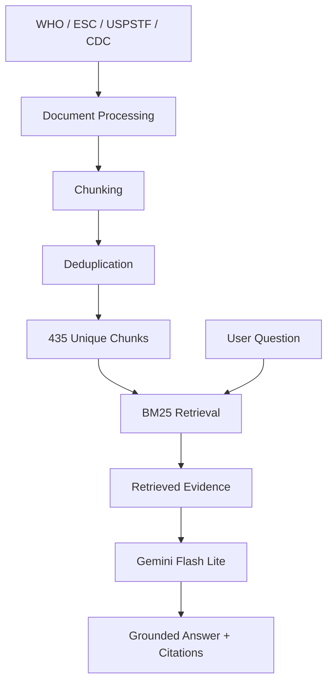
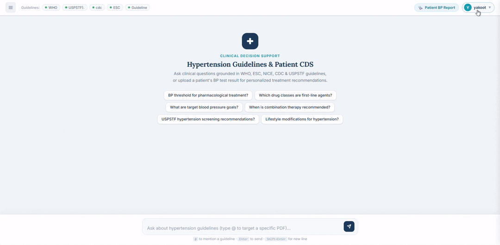

# Hypertension Guideline RAG

**AI Clinical Decision Support Hackathon Project**

A retrieval-augmented generation (RAG) system for answering hypertension-related questions using evidence retrieved from established clinical guidelines. The system focuses on keeping responses grounded in the retrieved sources and providing citations for the supporting evidence.

---

## Overview

The project uses four sources covering hypertension treatment, screening, and population data:

* **WHO 2021** — Pharmacological Treatment of Hypertension in Adults
* **ESC 2024** — European Society of Cardiology Guidelines
* **USPSTF** — Hypertension Screening Recommendation
* **CDC Health E-Stats** — Adult Hypertension Data

The final retrieval pipeline uses **BM25 over a deduplicated corpus of 435 chunks**. Retrieved evidence is passed to **Google Gemini Flash Lite**, which generates the final response based on the provided context.

The original corpus contained **813 chunks**. After preprocessing and deduplication, this was reduced to **435 unique chunks**.

---

## Results

The system was evaluated on a **200-question benchmark** covering retrieval, answer correctness, faithfulness, and citation quality.

| Metric                |          Result |
| --------------------- | --------------: |
| **Hit@1**             |       **75.5%** |
| **Hit@5**             |       **94.5%** |
| **MRR**               |       **0.826** |
| **Retrieval latency** | **~2 ms/query** |
| **Faithfulness**      |     **5.0 / 5** |
| **Correctness**       |    **4.84 / 5** |
| **Citation validity** |        **0.99** |

The largest improvement during the retrieval experiments came from deduplication. Reducing the corpus from **813 to 435 chunks improved Hit@1 by 17.5 percentage points**.

---

## Retrieval

The final system uses **BM25** as the main retrieval method.

Several retrieval configurations were tested during development, including dense and hybrid approaches. BM25 provided the best overall balance for this dataset, giving strong retrieval performance while keeping the system simple and fast.

The retrieval pipeline operates on the deduplicated corpus and returns the most relevant guideline chunks for each query.

---

## Generation

Retrieved chunks are provided to **Google Gemini Flash Lite** using a grounding-focused prompt.

The generation pipeline is designed to:

* Base answers on the retrieved evidence.
* Include citations to the supporting sources.
* Avoid adding information that is not supported by the retrieved context.
* Refuse to provide an answer when sufficient evidence is not available.
* Use a low temperature for more consistent responses.

In the 200-question evaluation, the generated answers received a **5.0/5 faithfulness score**, with no hallucinations identified by the evaluation process.

---

## Architecture



---

## Tech Stack

| Component            | Technology                                       |
| -------------------- | ------------------------------------------------ |
| **Language**         | Python 3.11                                      |
| **Retrieval**        | BM25 · `rank-bm25`                               |
| **Vector Store**     | Qdrant                                           |
| **Embeddings**       | Google `gemini-embedding-001` (3072-d)           |
| **Generation**       | Google Gemini Flash Lite                         |
| **Chunking**         | `tiktoken` (600-token chunks / 80-token overlap) |
| **UI**               | Gradio                                           |
| **Backend**          | Flask                                            |
| **Deployment**       | Hugging Face Spaces                              |
| **Containerization** | Docker                                           |
| **Server**           | Waitress                                         |
| **Evaluation**       | Custom benchmark + LLM-based evaluation          |

---

## Demo



*A short demonstration of the system, from submitting a question to receiving a grounded answer with supporting sources.*

---

## Creativa Orange Hackathon


This project was developed as part of the **Creativa Orange Hackathon**.

The goal was to build a practical RAG-based system that could make information from hypertension guidelines easier to access while keeping the generated answers tied to the underlying sources.

### Highlights

* 200-question evaluation benchmark
* **94.5% Hit@5**
* **75.5% Hit@1**
* **5.0/5 faithfulness**
* **4.84/5 correctness**
* **0.99 citation validity**
* **~2 ms/query retrieval latency**
* **813 → 435 chunks** after deduplication
* **+17.5 percentage points in Hit@1** from deduplication
* Live deployment using Gradio and Hugging Face Spaces

---

## Team

This project was built as a team for the **Creativa Orange Hackathon**.

A big thank you to everyone who contributed their time, ideas, and effort:

* **Yakoot Shaker**
* **Yasser Eldaly**
* **Youssef Gomaa**
* **Mostafa Hazem**

I really appreciate the work and collaboration that everyone put into making this project happen.

---

## Quick Start

### 1. Install dependencies

```bash
pip install -r requirements.txt
```

### 2. Set your Gemini API key

**Windows PowerShell:**

```powershell
$env:GEMINI_API_KEY="your_key_here"
```

**Windows CMD:**

```cmd
set GEMINI_API_KEY=your_key_here
```

**Linux / macOS:**

```bash
export GEMINI_API_KEY="your_key_here"
```

### 3. Run the application

```bash
python gradio_app.py
```

The Gradio interface will be available at:

```text
http://localhost:7860
```

---

## Repository Structure

```text
.
├── Dockerfile
├── README.md
├── app.py
├── gradio_app.py
├── requirements.txt
│
├── data/
│   └── processed/
│       └── # Validated chunks and deduplication artifacts
│
├── evaluation/
│   ├── EXPERIMENTS.md
│   ├── EVALUATION_REPORT.pdf
│   ├── generation_results.json
│   └── retrieval_200_dedup_results.json
│
└── src/
    └── rag/
        ├── bm25_retriever.py
        ├── rag_pipeline.py
        └── ...
```

---

## Evaluation

Detailed evaluation results and experiments are available in the `evaluation/` directory:

* `EXPERIMENTS.md` — retrieval experiments and comparisons
* `EVALUATION_REPORT.pdf` — complete evaluation report
* `retrieval_200_dedup_results.json` — retrieval benchmark results
* `generation_results.json` — generation evaluation results

---

## Medical Disclaimer

This project is a **hackathon and research prototype** and is not intended to replace professional medical judgment or serve as a medical device.

The system is designed to demonstrate grounded retrieval and generation over hypertension guidelines. Clinical decisions should be based on the original guidelines, patient-specific information, and the judgment of qualified healthcare professionals.

---

## License

MIT License.
