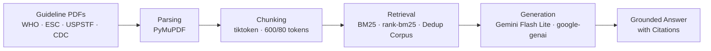

# System Architecture Flowchart

Mermaid diagram — render it on [mermaid.live](https://mermaid.live), GitHub, or VS Code
(Mermaid Preview extension).

```mermaid
flowchart LR
    PDF[Guideline PDFs<br/>WHO · ESC · USPSTF · CDC]
    PARSE[Parsing<br/>PyMuPDF]
    CHUNK[Chunking<br/>tiktoken · 600/80 tokens]
    RETR[Retrieval<br/>BM25 · rank-bm25 · Dedup Corpus]
    GEN[Generation<br/>Gemini Flash Lite · google-genai]
    ANS[Grounded Answer<br/>with Citations]

    PDF --> PARSE --> CHUNK --> RETR --> GEN --> ANS
```